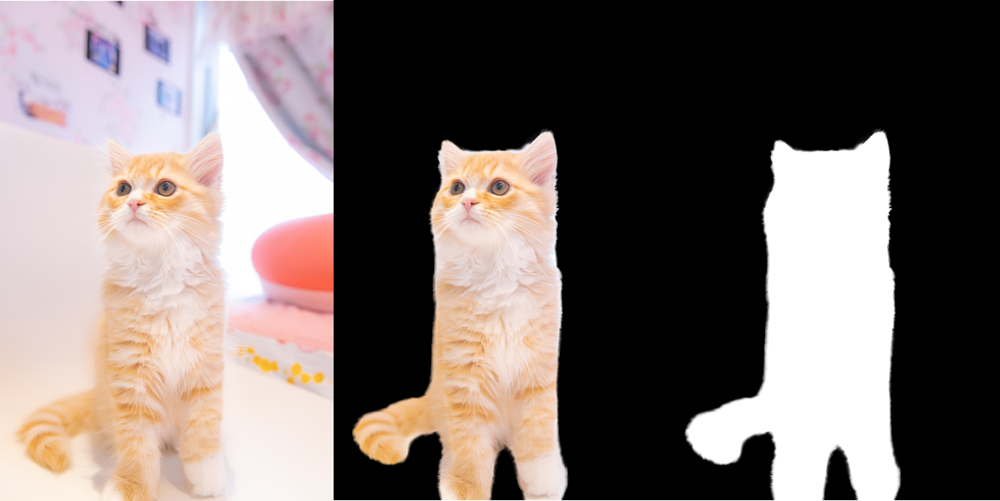
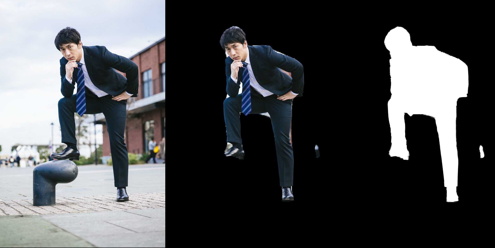

# remove_bg
Remove background from image



*original image from [PAKUTASO](https://www.pakutaso.com/)*

## Workflow

1. Create mask image using Image Segmentation technique.
2. Create trimap image using Morphology(`cv2.erode()`,`cv2.dilate()`).
3. Matting image using [FBA_Matting](https://github.com/MarcoForte/FBA_Matting)

## Supported input image format

- `.png`
- `.jpg`

## How to Use

### 1. Clone this repo

```bash
$ git clone https://github.com/takecx/remove_bg.git
$ cd remove_bg
```

### 2. Restore submodule

```bash
$ git submodule update -i
```

### 3. Download `FBA_Matting` model.

Download `FBA_Matting` model from [here](https://drive.google.com/uc?id=1T_oiKDE_biWf2kqexMEN7ObWqtXAzbB1) and place it to `./FBA_Matting/FBA.pth`

### 4. Create Environment

You should create python environment using `requirements.txt`.

```bash
$ conda create -n remove_bg python=3.7
$ conda activate remove_bg
$ pip install -r requirements.txt
```

### 5. Run script

Run `BackgroundRemover.py` with some arguments.

```bash
$ python BackgroundRemover.py (image_file) --kernel_size (morphology kernel size) --iteration (morphology iteration num)
```

#### Arguments

1. input image file path (required)
2. `--kernel_size` : kernel size of morphology conversion (optional)
3. `--iteration` : iteration num of morphology conversion (optional)

For example, 

- input image file path : `./examples/images/sample.png`
- `--kernel_size` : 5
- `--iteration` : 3

then, you run 

```bash
$ python BackgroundRemover.py ./examples/images/sample.png --kernel_size 5 --iteration 3
```
